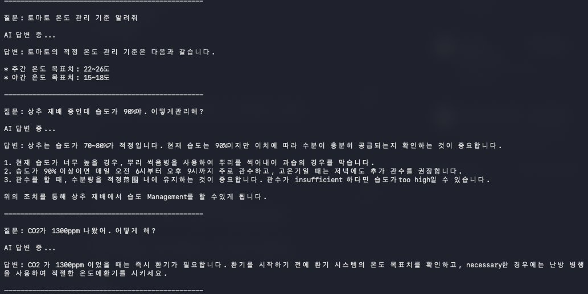
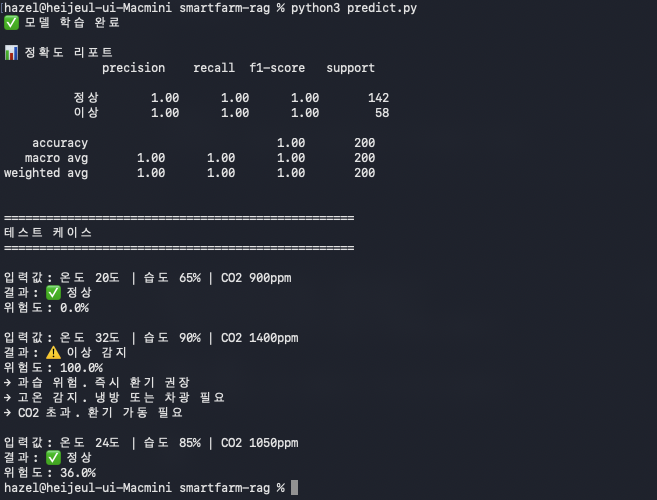

# 🌱 SmartFarm RAG + 예측 모델
스마트팜 환경 데이터 기반 Local LLM 질의응답 및 이상 감지 시스템

## 📌 개발 배경
스마트팜 환경 데이터를 수집·관리하는 플랫폼을 가정해, 단순 모니터링을 넘어 농민이 자연어로 질문하면 데이터 기반으로 답하고 이상값을 사전에 감지할 수 있는 구조를 직접 검증해보고자 만들었습니다. 실제 농장 데이터 없이 구조 검증을 목적으로 설계했으며, 실제 센서 데이터가 있다면 동일한 구조로 연결할 수 있을 것 같습니다.

## 🛠️ Tech Stack
* Language: Python 3.9
* LLM: Llama 3.2 (Ollama — 완전 로컬 실행)
* RAG Framework: LangChain + ChromaDB
* 예측 모델: scikit-learn (RandomForest)

## 📁 구성
| 파일 | 설명 |
|---|---|
| `rag.py` | 농업 매뉴얼 기반 자연어 질의응답 |
| `predict.py` | 온도·습도·CO2 기반 이상값 예측 |
| `farming_data.txt` | 작물별 환경 관리 매뉴얼 |

## 📊 설계 노트

정상 600건 / 이상 400건으로 구성했습니다. 이상 패턴을 충분히 학습시키기 위해 이상 비율을 의도적으로 높였습니다. 다양한 케이스를 커버하기 위해 정상과 이상의 경계값을 의도적으로 겹치게 설정했습니다. 완전히 분리된 데이터로 학습하면 정확도 100%가 나오지만 실제 상황을 반영하지 못합니다. RandomForest는 온도·습도·CO2 세 조건이 복합적으로 작용하는 상황에 적합해 선택했습니다. 초기 RAG 구현에서 한국어 응답이 불안정해 프롬프트에 언어와 문서 범위를 명시하는 방식으로 개선했습니다.

## 💬 실행 화면
### RAG — 자연어 질의응답


### 예측 모델 — 환경 이상 감지


## ▶️ 실행 방법
```bash
ollama pull llama3.2
pip install langchain langchain-community chromadb ollama scikit-learn pandas
python3 rag.py
python3 predict.py
```

## ⚠️ 한계 및 개선 방향
- 정적 텍스트 기반 — 실시간 센서 연동 시 동일 구조 적용 가능
- 가상 데이터 학습 — 실제 농장 데이터로 재학습 필요
- 단일 농장 기준 — 다중 농장 구조는 추후 고려해볼 부분

## 👤 Author
ksks723

## 📄 License
© 2026 ksks723
This repository is not open source. All rights reserved.
